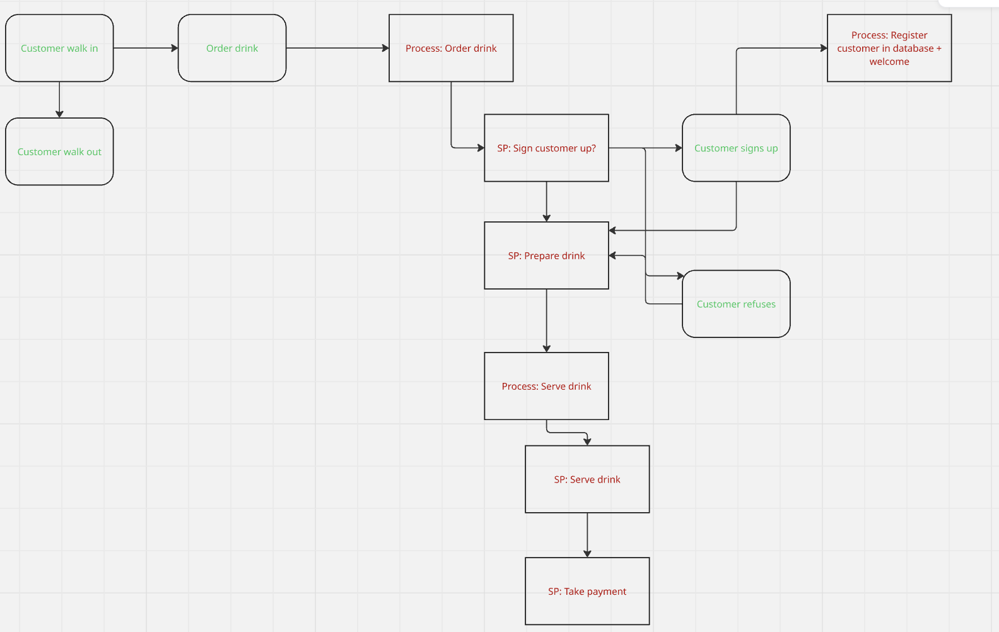

A proof of concept for an automated business analyst tool

For this POC I'll attempt to simulate the following business:

In this case, events (real world incidents) are in green, and processes (business processes) are in red.

This flowchart is then translated to two csv files, events.csv and processes.csv (in app/processes_and_events)

The script consists of the following modules:
- AI: This module deals with the interface to OpenAI and retrieves insights and analytics on existing records

- DB: This module deals with populating the database automatically from the given process and event CSVs (load_events_and_processes.py), fetching db connections (connections.py), exporting the database to CSVs (export_to_csv.py) and pretty printing the database.

- ENGINE: This module will deal with the actual handling of events and associated processes. For now, it's fairly skeletal

- SIMULATOR: A module to simulate the day to day runnings of the business, mainly for testing the proof of concept. Consists of a customer_simulator that aims to model customer behaviour via Markov chains, and a data_generator that simulates the runnings of a business over a 2 week period including customers coming in and placing orders.

